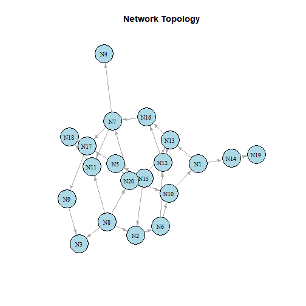
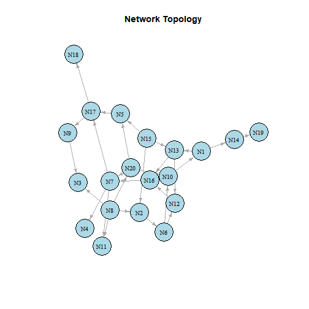
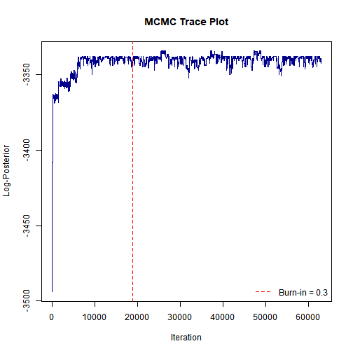
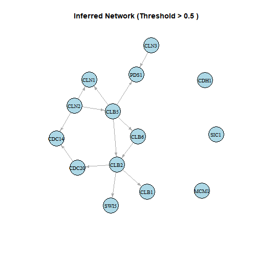

# Bayesian Boolean Network Inference with BBNI

## Overview

The `BBNI` (Bayesian Boolean Network Inference) package implements the
Bayesian Boolean network inference algorithm of [Han et
al. (2014)](https://doi.org/10.1371/journal.pone.0115806) on binary
gene-expression data. The package computes both the directed network
topology (including root and non-root nodes) and the Boolean transition
functions corresponding to each defined node.

This approach deliberately attempts to compensate for biological noise
and model uncertainty, two central priorities stated in [Han et
al. (2014)](https://doi.org/10.1371/journal.pone.0115806). Employing a
Metropolis-within-Gibbs Markov chain Monte Carlo (MCMC) process, the
`BBNI` sampler is able to estimate the posterior distribution of valid
directed acyclic graph (DAG) topologies and their corresponding Boolean
logic functions.

This vignette presents an example simulated workflow utilizing the
package. That is, simulating a noisy dataset from an initial topology
and transition functions; running the implemented MCMC sampler; and
lastly, running various evaluation tests to determine how well the
algorithm recovered the original topology and Boolean functions.

## Setup and simulation

First, we load the package:

``` r

library(BBNI)
```

After setup, we will use the package’s simulation functions
`GenerateNetwork` and `GenerateSample` (both exported). These will
initialize a random, known network topology and the associated
transition functions, and subsequently take a simulated sample from it
(either time-series or independent). Keeping a stored reference point
allows for assessment of final recovery of both the edge structure and
the Boolean transition functions.

``` r

set.seed(303)
num_nodes <- 20
sample_size <- 110

# 1. Generate random DAG topology (T) and associated Boolean transition functions (F)
true_network <- GenerateNetwork(num.node = num_nodes)
# visualize "true" synthetic topology before inference
plot_network(true_network)
```



plot of chunk simulate-data

``` r


# 2. Set Beta prior hyperparameters. Root nodes use Beta(3, 3), defining a prior
#    mean of 0.5 while also permitting node-specific variation. Final row specifies
#    hyperparameters for the global noise parameter and satisfies beta1 < beta2.
prior_para <- matrix(3, nrow = num_nodes + 1, ncol = 2)
prior_para[num_nodes + 1, 1] <- 2
prior_para[num_nodes + 1, 2] <- 100

# Sample independent root node expression probabilities from Beta priors
para <- numeric(num_nodes + 1)
for (i in 1:(num_nodes + 1)) {
  para[i] <- rbeta(1, prior_para[i, 1], prior_para[i, 2])
}
# For simulation, fix the noise rate at 20% instead of the raw
# Beta(2, 100) draw so we have clear benchmark for validation.
para[num_nodes + 1] <- 0.20

# 3. Generate noise matrix and simulate observational dataset (G)
error_matrix <- matrix(rbinom(num_nodes * sample_size, 1, para[num_nodes + 1]),
  nrow = num_nodes, ncol = sample_size
)
simulated_data <- GenerateSample(
  trans_matrix = true_network,
  num.node = num_nodes,
  SampleSize = sample_size,
  para = para,
  error = error_matrix
)
# BBNI also supports independent data. By toggling timeseries = FALSE, the algorithm
# resolves parent and child states at the same time within the exact same sample
# rather than assuming time lag
# NOTE: We won't execute a separate simulated chain for this, as the real-world
# application section will already demonstrate independent data functionality
simulated_data_indep <- GenerateSample(
  trans_matrix = true_network,
  num.node = num_nodes,
  SampleSize = sample_size,
  para = para,
  error = error_matrix,
  timeseries = FALSE
)
```

`true_network` is a `num_nodes` x `num_nodes` matrix encoding both the
DAG topology generated by `GenerateNetwork`:

- An entry of `0` at position `[i, j]` signifies that node `j` is not a
  parent of node `i`.
- A nonzero entry at `[i, j]` signifies that node `j` is a parent of
  node `i`; the integer value corresponds to the Boolean transition
  function defining that parent relation.

`simulated_data` is the simulated observed data matrix (\\G\\): a
`num_nodes` x `sample_size` binary matrix in which each row represents a
gene/node and each column represents an observation. The matrix is
simulated from the Boolean logic defined in `true_network` and then
distorted using the simulated noise matrix (`error_matrix`).

For real-world usage, `GeneData` must use the same format: an `n` x `m`
binary matrix with rows corresponding to nodes, like genes, and columns
corresponding to observations or sequenced time points. All entries must
be recorded as binary (0/1) expression states.

## Running the MCMC sampler

We next execute
[`run_bbni()`](https://anson-li8.github.io/BBNI/reference/run_bbni.md)
on the simulated data. The main arguments are:

- `num_update` - total number of MCMC outer iterations.
- `penalty` - structural-prior hyperparameter that penalizes graph
  density and complexity.
- `prop.ratio` - mixing weight for the proposal distribution;
  specifically, the probability of selecting the empirical proposal
  rather than a uniform random move.
- `prior_para` - hyperparameter matrix in which the first `n` rows
  define Beta prior parameters for root-node Bernoulli activation
  probabilities; row `n+1` sets the prior parameters for the global
  noise rate \\e\\, with the required constraint \\\beta_1 \< \beta_2\\.
- `burn_in` - numeric value between 0 and 1 representing the proportion
  of initial MCMC samples to discard as burn-in. The leftover samples
  are used to calculate posterior edge probabilities.

``` r

# Define MCMC and prior hyperparameters
num_update <- 5000 # Total MCMC iterations
penalty <- 0.1 # Structural prior penalty for network complexity
prop_ratio <- 0.1 # Initial proposal mixture coefficient

run_start <- Sys.time()
mcmc_results <- run_bbni(
  GeneData = simulated_data,
  num.node = num_nodes,
  SampleSize = sample_size,
  prior_para = prior_para,
  num_update = num_update,
  penalty = penalty,
  prop.ratio = prop_ratio,
  timeseries = TRUE,
  burn_in = 0.75
)

run_end <- Sys.time()
```

[`run_bbni()`](https://anson-li8.github.io/BBNI/reference/run_bbni.md)
accepts a `verbose` argument (default `FALSE`) that displays a text
progress bar during sampling; it’s left default here to keep the
vignette clean.

``` r

cat(
  "Sampler completed", num_update, "iterations (",
  num_nodes * num_update, "node updates) in",
  round(as.numeric(difftime(run_end, run_start, units = "mins")), 2), "minutes\n"
)
#> Sampler completed 5000 iterations ( 1e+05 node updates) in 2.92 minutes
```

As of v0.2.1, the MCMC sampler has been significantly optimized relative
to the original CRAN release (v0.1.1). A parallel benchmark on this
exact 5000-iteration workflow completed in 4.48 minutes versus 62.75
minutes, a 92.9% reduction in runtime with numerically identical output.

## Analyzing the output

[`run_bbni()`](https://anson-li8.github.io/BBNI/reference/run_bbni.md)
returns a list containing the sampled path of the Markov chain:

- `log_posterior` - numeric vector of log-posterior values stored after
  each node-level update.
- `networks` - list of sampled transition-function matrices. Each
  element shares the same format as `true_network`.
- `post_edge_prob`- matrix of marginal posterior edge probabilities
  calculated after discarding burn_in period
- `burn_in`- the `burn_in` ratio returned back to user for posterior
  reference

### Convergence: trace plot

A trace plot of the log-posterior over MCMC updates evaluates chain
behavior. Given that we know the specific ground-truth network, we can
further compute the log-posterior of the true network via the package’s
internal `Error_LLH()` function and graph it as a reference baseline:

``` r

# Evaluate log-posterior value of the true network
# Call the unexported package function to compute a reference log-posterior
# for the ground-truth network.
true_logpost_raw <- BBNI:::Error_LLH(
  TRFUM = true_network, GeneData = simulated_data,
  SampleSize = sample_size, num.node = num_nodes,
  prior_para = prior_para, penalty = penalty,
  timeseries = TRUE
)
# The log-posterior value is the last element of the first returned vector.
true_logpost <- true_logpost_raw[[1]][length(true_logpost_raw[[1]])]

# Draw base trace plot with package function
plot_trace(mcmc_results)

# Add true-network reference value.
abline(h = true_logpost, col = "firebrick", lty = 2, lwd = 2)
legend("bottomleft",
       legend = "True network log-posterior",
       col = "firebrick", lty = 2, lwd = 2, bty = "n")
```


plot of chunk trace-plot

Note that the horizontal axis has units of node-level updates rather
than outer MCMC iterations. The convergence of the log-posterior towards
the baseline value is an indication of chain success. With statistical
variation being inevitable, a perfect match with the true topology and
Boolean functions is not expected from a single posterior sample.

### Final sampled network

The final sampled network can be visualized as follows:

``` r

final_network <- tail(mcmc_results$networks, 1)[[1]]
plot_network(final_network)
```



plot of chunk view-results

### Recovery of the true network

As we know the true network, we can quantify the recovery by comparing
the final sampled network with the true edge structure and Boolean
transition functions:

``` r

true_edges <- true_network > 0
final_edges <- final_network > 0

true_positive <- sum(true_edges & final_edges) # correctly recovered edges
false_positive <- sum(!true_edges & final_edges) # spurious edges
false_negative <- sum(true_edges & !final_edges) # missed true edges

cat("True edges in the network:       ", sum(true_edges), "\n")
#> True edges in the network:        29
cat("Correctly recovered edges:       ", true_positive, "\n")
#> Correctly recovered edges:        28
cat("Spurious (false positive) edges: ", false_positive, "\n")
#> Spurious (false positive) edges:  0
cat("Missed (false negative) edges:   ", false_negative, "\n")
#> Missed (false negative) edges:    1

# Among the correctly-recovered edges, how many also got the right
# Boolean function?
correct_function_final <- sum(true_edges & final_edges & (true_network == final_network))
cat("...of which function also correct: ", correct_function_final, "out of", true_positive, "\n")
#> ...of which function also correct:  27 out of 28
```

Once again, some deviation is reasonable because this comparison uses
only one sample from the end of the Markov chain. A posterior summary
across multiple samples may allow a more stable estimate.

### Posterior summarization by Bayesian model averaging

Instead of relying on a single sampled network, we can summarize the
posterior distribution by Bayesian model averaging (BMA) over several
retained network samples. This allows calculation of posterior
edge-inclusion probabilities, which are often more informative than a
single end sample. In biological applications, reducing false-positive
edges is particularly important, as each predicted interaction may
warrant costly experimental validation.

We first discard an initial burn-in period, here set to 75% of the
recorded chain to match the burn-in convention used in [Han et
al. (2014)](https://doi.org/10.1371/journal.pone.0115806)’s own
simulation studies, instead of
[`run_bbni()`](https://anson-li8.github.io/BBNI/reference/run_bbni.md)’s
own default `burn_in` value of 70%. This is to reduce the impact of the
unpredictability of the arbitrary starting structure. We then retain one
network per outer iteration (every `num.node` node-level updates) to
account for the strong statistical dependence of within-iteration
samples. For each directed edge, the posterior inclusion probability is
calculated as the fraction of retained samples in which that edge
appears:

``` r

bma_edges <- mcmc_results$post_edge_prob > 0.5
bma_tp <- sum(true_edges & bma_edges)
bma_fp <- sum(!true_edges & bma_edges)
bma_fn <- sum(true_edges & !bma_edges)
cat("Correctly recovered edges:       ", bma_tp, "\n")
#> Correctly recovered edges:        29
cat("Spurious (false positive) edges: ", bma_fp, "\n")
#> Spurious (false positive) edges:  0
cat("Missed (false negative) edges:   ", bma_fn, "\n")
#> Missed (false negative) edges:    0
```

### Visualizing network recovery

The following plot compares the true network and the BMA consensus
network. Edges that are structurally correct but assigned the wrong
Boolean function are marked differently from edges for which both the
parent relation and function are correctly recovered. Only edges with a
computed statistical probability of higher than 50% are shown:

``` r

plot_bbni(mcmc_results, true_network = true_network, threshold = 0.5)
```


plot of chunk visualize-network

## Application to real-world biological data

The workflow above uses simulated data so that the inferred network can
be compared with a known ground truth. For empirical biological data,
the same inference procedure can be applied with an expression matrix
that is both binary and in the required `num.node` x `SampleSize`
format. Since true topology is generally unknown in real applications,
posterior edge-inclusion probabilities, convergence assessment, and
biological plausibility should be emphasized over direct recovery
metrics.

The original study by [Han et
al. (2014)](https://doi.org/10.1371/journal.pone.0115806) applied the
Bayesian Boolean network framework to yeast cell-cycle expression data
and compared the inferred relationships with a reference cell-cycle
network. A package-level empirical example can follow the same
structure: load a binary expression matrix, run
[`run_bbni()`](https://anson-li8.github.io/BBNI/reference/run_bbni.md),
examine trace behavior, summarize posterior edge probabilities, and
interpret high-probability interactions in relation to existing
biological knowledge.

Running BBNI on the pooled yeast cell-cycle dataset recovers a
biologically consistent subnetwork, matching the specific relationships
emphasized in the original [Han et
al. (2014)](https://doi.org/10.1371/journal.pone.0115806) paper’s
real-data analysis. The model identifies CLB2 as a direct regulator of
SWI5, matching the paper’s reported finding. It also recovers all three
“coupled” gene pairs that the original paper specifically mentions —
CLN1/CLN2, CLB1/CLB2, and CLB5/CLB6 — as directly linked. The original
paper acknowledges that “12.82% of the links in the reference yeast
cell-cycle network… are identified in 100% of the posterior samples.”
Similarly, the inferred network here is intentionally sparse rather than
dense with interconnected genes. Furthermore, several genes (SIC1, CDH1,
MCM1) show no high-confidence links in this dataset, reflecting the
partial-recovery limitation of real biological data that the original
authors reported.

``` r

# Load empirical yeast cell-cycle dataset (14 genes x 385 pooled conditions)
# from the original Han et al. 2014 paper
data("yeast_data")

# Use same priors as earlier simulated example
yeast_prior_para <- matrix(3, nrow = nrow(yeast_data) + 1, ncol = 2)
yeast_prior_para[nrow(yeast_data) + 1, 1] <- 2
yeast_prior_para[nrow(yeast_data) + 1, 2] <- 100

run_start <- Sys.time()

# Run in independent mode: these 385 pooled columns include many distinct experimental
# conditions (MMS exposure, gamma radiation, heat shock, etc.), not a single
# continuous time series, so timeseries = FALSE is the correct model here.
yeast_results <- run_bbni(
  GeneData = yeast_data,
  prior_para = yeast_prior_para,
  num_update = 4500,
  penalty = 0.1,
  prop.ratio = 0.1,
  timeseries = FALSE,
  burn_in = 0.3,
  verbose = FALSE
)

run_end <- Sys.time()
# Duration of chain
cat(
  "Sampler completed", 4500, "iterations (",
  nrow(yeast_data) * 4500, "node updates) in",
  round(as.numeric(difftime(run_end, run_start, units = "mins")), 2), "minutes\n"
)
#> Sampler completed 4500 iterations ( 63000 node updates) in 1.49 minutes

# Visualize results
plot_trace(yeast_results)
```



plot of chunk yeast-data

``` r

plot_bbni(yeast_results, node_names = rownames(yeast_data), threshold = 0.5)
```



plot of chunk yeast-data

## Next steps

This vignette demonstrates the core `BBNI` workflow on simulated data.
From here:

- See
  [`?run_bbni`](https://anson-li8.github.io/BBNI/reference/run_bbni.md),
  [`?GenerateNetwork`](https://anson-li8.github.io/BBNI/reference/GenerateNetwork.md),
  and
  [`?GenerateSample`](https://anson-li8.github.io/BBNI/reference/GenerateSample.md)
  for function-level documentation.
- The simulated example runs 5000 iterations on a 20-node network.
  Larger networks, noisier data, or higher-precision posterior summaries
  may require significantly more iterations.
- For user-supplied expression data, format `GeneData` as a binary
  `num.node` x `SampleSize` matrix, as described above.

## Session information

``` r

sessionInfo()
#> R version 4.6.0 (2026-04-24 ucrt)
#> Platform: x86_64-w64-mingw32/x64
#> Running under: Windows 11 x64 (build 28020)
#> 
#> Matrix products: default
#>   LAPACK version 3.12.1
#> 
#> locale:
#> [1] LC_COLLATE=Spanish_Latin America.utf8  LC_CTYPE=Spanish_Latin America.utf8    LC_MONETARY=Spanish_Latin America.utf8 LC_NUMERIC=C                           LC_TIME=Spanish_Latin America.utf8    
#> 
#> time zone: America/Chicago
#> tzcode source: internal
#> 
#> attached base packages:
#> [1] stats     graphics  grDevices utils     datasets  methods   base     
#> 
#> other attached packages:
#> [1] BBNI_0.2.1
#> 
#> loaded via a namespace (and not attached):
#>  [1] compiler_4.6.0  magrittr_2.0.5  cli_3.6.6       tools_4.6.0     otel_0.2.0      igraph_2.3.3    knitr_1.51      xfun_0.60       lifecycle_1.0.5 pkgconfig_2.0.3 rlang_1.3.0     bitops_1.0-9   
#> [13] evaluate_1.0.5
```
