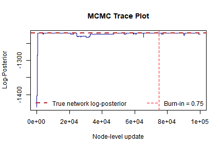
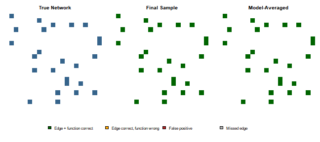

## Overview

The `BBNI` (Bayesian Boolean Network Inference) package implements the Bayesian Boolean network inference algorithm of [Han et al. (2014)](https://doi.org/10.1371/journal.pone.0115806) on binary gene-expression data. The package computes both the directed network topology (including root and non-root nodes) and the Boolean transition functions corresponding to each defined node.

This approach deliberately attempts to compensate for biological noise and model uncertainty, two central priorities stated in [Han et al. (2014)](https://doi.org/10.1371/journal.pone.0115806). Employing a Metropolis-within-Gibbs Markov chain Monte Carlo (MCMC) process, the `BBNI` sampler is able to estimate the posterior distribution of valid directed acyclic graph (DAG) topologies and their corresponding Boolean logic functions.

This vignette presents an example simulated workflow utilizing the package. That is, simulating a noisy time-series dataset from an initial topology and transition functions; running the implemented MCMC sampler; and lastly, running various evaluation tests to determine how well the algorithm recovered the original topology and Boolean functions.

## Setup and simulation

First, we load the package:


``` r
library(BBNI)
```

After setup, we will use the package's simulation functions `GenerateNetwork` and `GenerateSample` (both exported). These will initialize a random, known network topology and the associated transition functions, then subsequently take a simulated time-series sample from it, respectively. Keeping a stored reference point allows for assessment of final recovery of both the edge structure and the Boolean transition functions.


``` r
set.seed(303)
num_nodes <- 20
sample_size <- 80

# 1. Generate random DAG topology (T) and associated Boolean transition functions (F)
true_network <- GenerateNetwork(num.node = num_nodes)

# 2. Set Beta prior hyperparameters. Root nodes use Beta(3, 3), defining a prior
#    mean of 0.5 while also permitting node-specific variation. Final row specifies
#    hyperparameters for the global noise parameter and satisfies beta1 < beta2.
prior_para <- matrix(3, nrow = num_nodes + 1, ncol = 2)
prior_para[num_nodes + 1, 1] <- 2
prior_para[num_nodes + 1, 2] <- 100

# Sample independent root node expression probabilities from Beta priors
para <- numeric(num_nodes + 1)
for (i in 1:(num_nodes + 1)) {
  para[i] <- rbeta(1, prior_para[i, 1], prior_para[i, 2])
}
# For simulation, fix the noise rate at 25% instead of the raw
# Beta(2, 100) draw so we have clear benchmark for validation.
para[num_nodes + 1] <- 0.25

# 3. Generate noise matrix and simulate observational dataset (G)
error_matrix <- matrix(rbinom(num_nodes * sample_size, 1, para[num_nodes + 1]),
  nrow = num_nodes, ncol = sample_size
)
simulated_data <- GenerateSample(
  trans_matrix = true_network,
  num.node = num_nodes,
  SampleSize = sample_size,
  para = para,
  error = error_matrix
)
```

`true_network` is a `num_nodes` x `num_nodes` matrix encoding both the DAG topology generated by `GenerateNetwork`:

- An entry of `0` at position `[i, j]` signifies that node `j` is not a parent of node `i`.
- A nonzero entry at `[i, j]` signifies that node `j` is a parent of node `i`; the integer value corresponds to the Boolean transition function defining that parent relation.

`simulated_data` is the simulated observed data matrix ($G$): a `num_nodes` x `sample_size` binary matrix in which each row represents a gene/node and each column represents an observation. The matrix is simulated from the Boolean logic defined in `true_network` and then distorted using the simulated noise matrix (`error_matrix`).

For real-world usage, `GeneData` must use the same format: an `n` x `m` binary matrix with rows corresponding to nodes, like genes, and columns corresponding to observations or sequenced time points. All entries must be recorded as binary (0/1) expression states.

## Running the MCMC sampler

We next execute `run_bbni()` on the simulated data. The main arguments are:

- `num_update` - total number of MCMC outer iterations.
- `penalty` - structural-prior hyperparameter that penalizes graph density and complexity.
- `prop.ratio` - mixing weight for the proposal distribution; specifically, the probability of selecting the empirical proposal rather than a uniform random move.
- `prior_para` - hyperparameter matrix in which the first `n` rows define Beta prior parameters for root-node Bernoulli activation probabilities; row `n+1` sets the prior parameters for the global noise rate $e$, with the required constraint $\beta_1 < \beta_2$.


``` r
# Define MCMC and prior hyperparameters
num_update <- 4000 # Total MCMC iterations
penalty <- 0.1 # Structural prior penalty for network complexity
prop_ratio <- 0.1 # Initial proposal mixture coefficient

run_start <- Sys.time()
mcmc_results <- run_bbni(
  GeneData = simulated_data,
  num.node = num_nodes,
  SampleSize = sample_size,
  prior_para = prior_para,
  num_update = num_update,
  penalty = penalty,
  prop.ratio = prop_ratio
)
run_end <- Sys.time()
```

`run_bbni()` prints a diagnostic log for each node-level update, resulting in `num.node` $\times$ `num_update` lines in total. The summary with the essential values is printed below:


``` r
cat(
  "Sampler completed", num_update, "iterations (",
  num_nodes * num_update, "node updates) in",
  round(as.numeric(difftime(run_end, run_start, units = "mins")), 2), "minutes\n"
)
#> Sampler completed 4000 iterations ( 80000 node updates) in 30.51 minutes
```

## Analyzing the output

`run_bbni()` returns a list containing the sampled path of the Markov chain:

- `log_posterior` - numeric vector of log-posterior values stored after each node-level update.
- `networks` - list of sampled transition-function matrices. Each element shares the same format as `true_network`.

### Convergence: trace plot

A trace plot of the log-posterior over MCMC updates evaluates chain behavior. Given that we know the specific ground-truth network, we can further compute the log-posterior of the true network via the package's internal `Error_LLH()` function and graph it as a reference baseline:


``` r
# Evaluate log-posterior value of the true network
# Call the unexported package function to compute a reference log-posterior
# for the ground-truth network.
true_logpost_raw <- BBNI:::Error_LLH(
  TRFUM = true_network, GeneData = simulated_data,
  SampleSize = sample_size, num.node = num_nodes,
  prior_para = prior_para, penalty = penalty
)
# The log-posterior value is the last element of the first returned vector.
true_logpost <- true_logpost_raw[[1]][length(true_logpost_raw[[1]])]

# Plot Markov chain trace against individual node-level updates.
plot(mcmc_results$log_posterior,
  type = "l",
  xlab = "MCMC Step (one per node update)", ylab = "Log-Posterior",
  main = "MCMC Trace Plot",
  ylim = range(c(mcmc_results$log_posterior, true_logpost))
)

# Add true-network reference value.
abline(h = true_logpost, col = "firebrick", lty = 2, lwd = 2)
legend("bottomright",
  legend = "True network log-posterior",
  col = "firebrick", lty = 2, lwd = 2, bty = "n"
)
```



Note that the horizontal axis has units of node-level updates rather than outer MCMC iterations. The convergence of the log-posterior towards the baseline value is an indication of chain success. With statistical variation being inevitable, a perfect match with the true topology and Boolean functions is not expected from a single posterior sample.

### Final sampled network

The final sampled network can be outputted as follows:


``` r
final_network <- tail(mcmc_results$networks, 1)[[1]]
final_network
#>       [,1] [,2] [,3] [,4] [,5] [,6] [,7] [,8] [,9] [,10] [,11] [,12] [,13] [,14] [,15] [,16] [,17] [,18] [,19] [,20]
#>  [1,]    0    0    0    0    0    0    0    0    0    11     0     0     0     0     0     0     0     0     0     0
#>  [2,]    0    0    0    0    0    0    0    0    0     0     0     0     0     0     0     0     0     0     0     0
#>  [3,]    0    0    0    0    0    0    0   11    0     0     0     0     0     0     0     0     0     0     0     0
#>  [4,]    0    0    0    0    0    0   12    0    0     0     0     0     0     0     0     0     0     0     0     0
#>  [5,]    0    0    0    0    0    0    0    0    0     0     0     0     0     0     6     0     0     0     0     6
#>  [6,]    0   12    0    0    0    0    0    0    0     0     0     0     0     0     0     0     0     0     0     0
#>  [7,]    0    0    0    0    0    0    0    0    0     0     0     0     0     0     0    11     0     0     0     0
#>  [8,]    0    0    0    0    0    0    0    0    0     0     0     0     0     0     0     0     0     0     0     0
#>  [9,]    0    0    0    0    0    0    0    0    0     0     0     0     0     0     0     0    12     0     0     0
#> [10,]    0    0    0    0    0    8    0    0    0     0     0     0     0     0     0     0     0     0     0     8
#> [11,]    0    0    0    0    0    0    3    3    0     0     0     0     0     0     0     0     0     0     0     0
#> [12,]    0    0    0    0    0    4    0    0    0     0     0     0     4     0     0     0     0     0     0     0
#> [13,]    5    0    0    0    0    0    0    0    0     0     0     0     0     0     5     0     0     0     0     0
#> [14,]   12    0    0    0    0    0    0    0    0     0     0     0     0     0     0     0     0     0     0     0
#> [15,]    0    0    0    0    0    0    0    0    0     0     0     0     0     0     0     0     0     0     0     0
#> [16,]    0    0    0    0    0    0    0    0    0     0     0     2     2     0     0     0     0     0     0     0
#> [17,]    0    0    0    0    0    0    0    0    0     0     0     0     0     0     0     0     0     0     0     0
#> [18,]    0    0    0    0    0    0    0    0    0     0     2     0     0     0     0     0     2     0     0     0
#> [19,]    0    0    0    0    0    0    0    0    0     0     0     0     0    12     0     0     0     0     0     0
#> [20,]    0    0    7    0    0    0    0    7    0     0     0     0     0     0     0     0     0     0     0     0
```

### Recovery of the true network

As we know the true network, we can quantify the recovery by comparing the final sampled network with the true edge structure and Boolean transition functions:


``` r
true_edges <- true_network > 0
final_edges <- final_network > 0

true_positive <- sum(true_edges & final_edges) # correctly recovered edges
false_positive <- sum(!true_edges & final_edges) # spurious edges
false_negative <- sum(true_edges & !final_edges) # missed true edges

cat("True edges in the network:       ", sum(true_edges), "\n")
#> True edges in the network:        29
cat("Correctly recovered edges:       ", true_positive, "\n")
#> Correctly recovered edges:        23
cat("Spurious (false positive) edges: ", false_positive, "\n")
#> Spurious (false positive) edges:  1
cat("Missed (false negative) edges:   ", false_negative, "\n")
#> Missed (false negative) edges:    6

# Among the correctly-recovered edges, how many also got the right
# Boolean function?
correct_function_final <- sum(true_edges & final_edges & (true_network == final_network))
cat("...of which function also correct: ", correct_function_final, "out of", true_positive, "\n")
#> ...of which function also correct:  20 out of 23
```

Once again, some deviation is reasonable because this comparison uses only one sample from the end of the Markov chain. A posterior summary across multiple samples may allow a more stable estimate.

### Posterior summarization by Bayesian model averaging

Instead of relying on a single sampled network, we can summarize the posterior distribution by Bayesian model averaging (BMA) over several retained network samples. This allows calculation of posterior edge-inclusion probabilities, which are often more informative than a single end sample. In biological applications, reducing false-positive edges is particularly important, as each predicted interaction may warrant costly experimental validation.

We first discard an initial burn-in period, here set to the first 75% of the recorded chain. This is to reduce the impact of unpredictability of the arbitrary starting structure. We then retain one network per outer iteration (every `num.node` node-level updates) to account for the strong statistical dependence of within-iteration samples. For each directed edge, the posterior inclusion probability is calculated as the fraction of retained samples in which that edge appears:


``` r
# Set burn-in to 75%, determined by visual inspection of the trace plot above.
burnin_cutoff <- round(0.75 * length(mcmc_results$log_posterior))

# Retain one sampled network per full outer iteration.
keep_idx <- seq(burnin_cutoff + 1, length(mcmc_results$log_posterior), by = num_nodes)
cat("Post-burn-in, pruned samples retained:", length(keep_idx), "\n")
#> Post-burn-in, pruned samples retained: 1000

# Estimate posterior edge-inclusion probabilities across retained samples.
edge_prob <- Reduce(`+`, lapply(mcmc_results$networks[keep_idx], function(m) (m > 0) * 1)) / length(keep_idx)
bma_edges <- edge_prob > 0.5 # classify an edge as present if its posterior probability exceeds 0.5

bma_tp <- sum(true_edges & bma_edges)
bma_fp <- sum(!true_edges & bma_edges)
bma_fn <- sum(true_edges & !bma_edges)

cat("Correctly recovered edges:       ", bma_tp, "\n")
#> Correctly recovered edges:        22
cat("Spurious (false positive) edges: ", bma_fp, "\n")
#> Spurious (false positive) edges:  0
cat("Missed (false negative) edges:   ", bma_fn, "\n")
#> Missed (false negative) edges:    7

# To evaluate Boolean function accuracy, take the posterior mode (most frequently
# sampled function code) for each matrix coordinate across the retained samples,
# then construct a consensus network topology.
get_mode_nonzero <- function(v) {
  nz <- v[v > 0]
  if (length(nz) == 0) return(0)
  tab <- table(nz)
  as.numeric(names(tab)[which.max(tab)])
}
sample_array <- simplify2array(mcmc_results$networks[keep_idx])
bma_function <- apply(sample_array, c(1, 2), get_mode_nonzero)

bma_network <- matrix(0, nrow = num_nodes, ncol = num_nodes)
bma_network[bma_edges] <- bma_function[bma_edges]

correct_function_bma <- sum(true_edges & bma_edges & (true_network == bma_network))
cat("...of which Boolean function also correct: ", correct_function_bma, "out of", bma_tp, "\n")
#> ...of which Boolean function also correct:  19 out of 22

missed_edge_idx <- which(true_edges & !final_edges)
fp_edge_idx <- which(!true_edges & final_edges)

cat("Posterior probability of the missed true edge:", edge_prob[missed_edge_idx], "\n")
#> Posterior probability of the missed true edge: 0.001 0.024 0.211 0.011 0.654 0.016
cat("Posterior probability of the false-positive edge:", edge_prob[fp_edge_idx], "\n")
#> Posterior probability of the false-positive edge: 0.358
```

### Visualizing network recovery

The following plot compares the true network, the final sampled network, and the BMA consensus network. Edges that are structurally correct but assigned the wrong Boolean function are marked differently from edges for which both the parent relation and function are correctly recovered:


``` r
# Evaluate each matrix entry compared to the true network: correct absence,
# fully correct edge, correct edge with wrong function, false positive,
# or missed edge (false negative).
classify_match <- function(true_net, sample_net) {
  true_e <- true_net > 0
  samp_e <- sample_net > 0
  out <- matrix(0, nrow = nrow(true_net), ncol = ncol(true_net))
  out[!true_e & !samp_e] <- 0                              # correct absence
  out[true_e & samp_e & (true_net == sample_net)] <- 1      # edge + function correct
  out[true_e & samp_e & (true_net != sample_net)] <- 2      # edge correct, function wrong
  out[!true_e & samp_e] <- 3                                # false positive
  out[true_e & !samp_e] <- 4                                # missed (false negative)
  out
}

final_match <- classify_match(true_network, final_network)
bma_match   <- classify_match(true_network, bma_network)

match_cols   <- c("white", "darkgreen", "orange", "firebrick", "gray70")
match_breaks <- c(-0.5, 0.5, 1.5, 2.5, 3.5, 4.5)
match_labels <- c("Edge + function correct", "Edge correct, function wrong",
                  "False positive", "Missed edge")

layout(matrix(c(1, 2, 3, 4, 4, 4), nrow = 2, byrow = TRUE), heights = c(4, 1))
par(mar = c(2, 2, 3, 1))
image(true_edges * 1, col = c("white", "steelblue4"), breaks = c(-0.5, 0.5, 1.5),
      axes = FALSE, main = "True Network")
image(final_match, col = match_cols, breaks = match_breaks, axes = FALSE, main = "Final Sample")
image(bma_match, col = match_cols, breaks = match_breaks, axes = FALSE, main = "Model-Averaged")
par(mar = c(0, 0, 0, 0))
plot.new()
legend("center", legend = match_labels, fill = match_cols[2:5], horiz = TRUE, bty = "n")
```



## Application to real-world biological data

The workflow above uses simulated data so that the inferred network can be compared with a known ground truth. For empirical biological data, the same inference procedure can be applied with an expression matrix that is both binary and in the required `num.node` x `SampleSize` format. Since true topology is generally unknown in real applications, posterior edge-inclusion probabilities, convergence assessment, and biological plausibility should be emphasized over direct recovery metrics.

The original study by [Han et al. (2014)](https://doi.org/10.1371/journal.pone.0115806) applied the Bayesian Boolean network framework to yeast cell-cycle expression data and compared the inferred relationships with a reference cell-cycle network. A package-level empirical example can follow the same structure: load a binary expression matrix, run `run_bbni()`, examine trace behavior, summarize posterior edge probabilities, and interpret high-probability interactions in relation to existing biological knowledge.

[PENDING]

## Next steps

This vignette demonstrates the core `BBNI` workflow on simulated data. From here:

- See `?run_bbni`, `?GenerateNetwork`, and `?GenerateSample` for function-level documentation.
- This example runs 4000 iterations on a 20-node network. Larger networks, noisier data, or higher-precision posterior summaries may require significantly more iterations.
- For user-supplied expression data, format `GeneData` as a binary `num.node` x `SampleSize` matrix, as described above.

## Session information


``` r
sessionInfo()
#> R version 4.6.0 (2026-04-24 ucrt)
#> Platform: x86_64-w64-mingw32/x64
#> Running under: Windows 11 x64 (build 28020)
#> 
#> Matrix products: default
#>   LAPACK version 3.12.1
#> 
#> locale:
#> [1] LC_COLLATE=Spanish_Latin America.utf8  LC_CTYPE=Spanish_Latin America.utf8    LC_MONETARY=Spanish_Latin America.utf8
#> [4] LC_NUMERIC=C                           LC_TIME=Spanish_Latin America.utf8    
#> 
#> time zone: America/Chicago
#> tzcode source: internal
#> 
#> attached base packages:
#> [1] stats     graphics  grDevices utils     datasets  methods   base     
#> 
#> other attached packages:
#> [1] BBNI_0.1.0
#> 
#> loaded via a namespace (and not attached):
#>  [1] styler_1.11.0      bitops_1.0-9       xml2_1.5.2         digest_0.6.39      magrittr_2.0.5     evaluate_1.0.5    
#>  [7] pkgload_1.5.2      fastmap_1.2.0      R.oo_1.27.1        R.cache_0.17.0     rprojroot_2.1.1    processx_3.9.0    
#> [13] R.utils_2.13.0     pkgbuild_1.4.8     sessioninfo_1.2.4  backports_1.5.1    brio_1.1.5         rcmdcheck_1.4.0   
#> [19] purrr_1.2.2        lintr_3.3.0-1      codetools_0.2-20   cli_3.6.6          rlang_1.2.0        crayon_1.5.3      
#> [25] R.methodsS3_1.8.2  ellipsis_0.3.3     commonmark_2.0.0   remotes_2.5.0      withr_3.0.2        cachem_1.1.0      
#> [31] devtools_2.5.2     otel_0.2.0         hunspell_3.0.6     tools_4.6.0        memoise_2.0.1      curl_7.1.0        
#> [37] vctrs_0.7.3        cyclocomp_1.1.2    R6_2.6.1           lifecycle_1.0.5    fs_2.1.0           xopen_1.0.1       
#> [43] usethis_3.2.1      pkgconfig_2.0.3    desc_1.4.3         callr_3.7.6        rex_1.2.2          pillar_1.11.1     
#> [49] Rcpp_1.1.1-1.1     glue_1.8.1         xfun_0.58          tibble_3.3.1       rstudioapi_0.18.0  knitr_1.51        
#> [55] spelling_2.3.2     testthat_3.3.2     compiler_4.6.0     prettyunits_1.2.0  roxygen2_8.0.0     xmlparsedata_1.0.5
```
